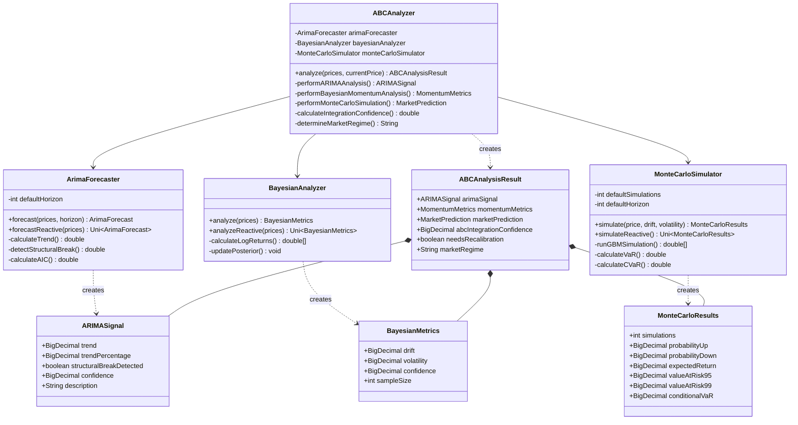
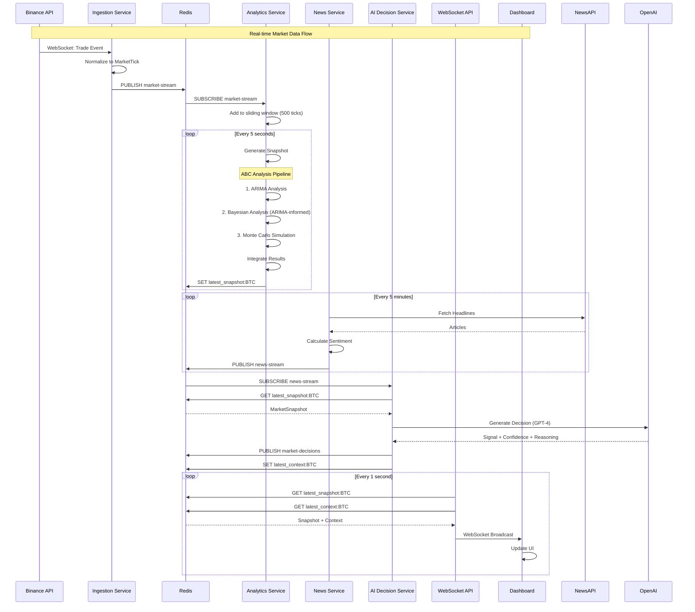
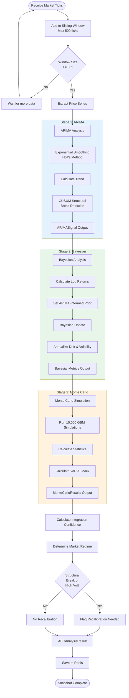
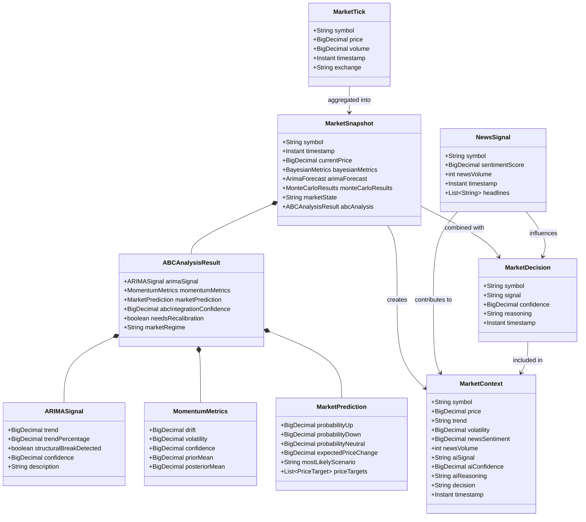
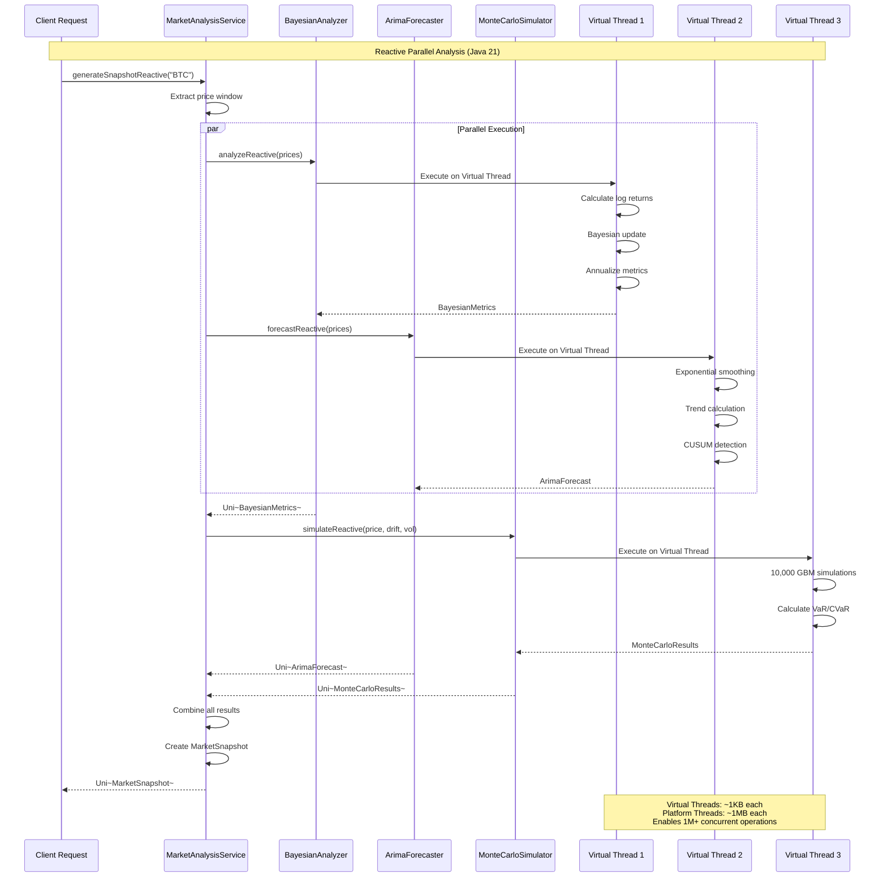
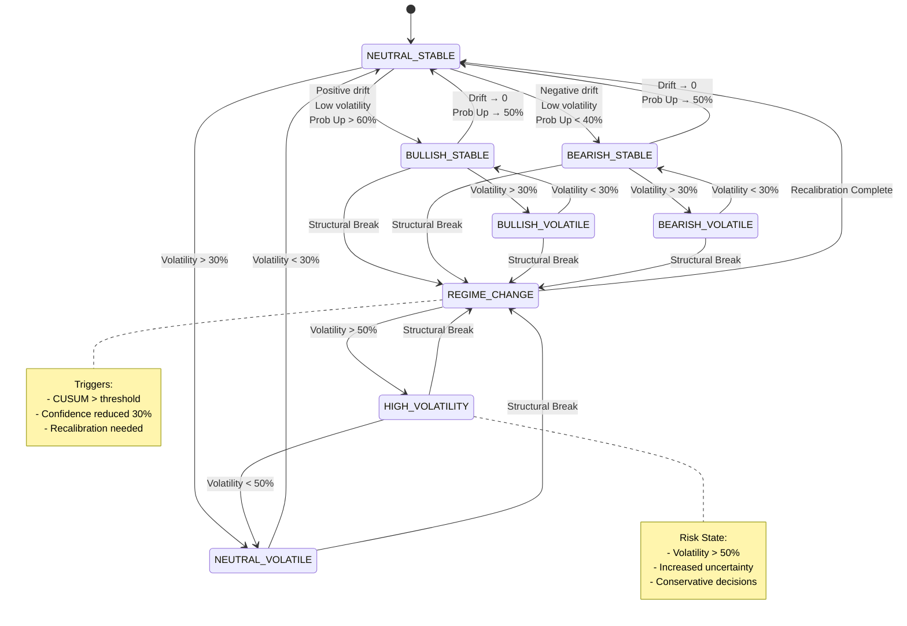
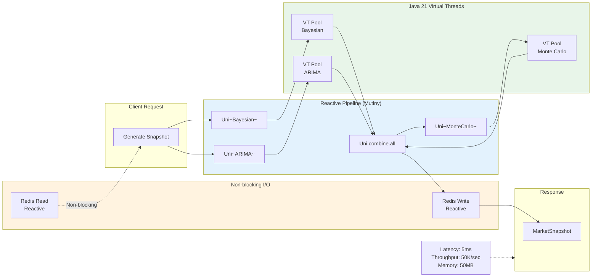

# Finbot UML Diagrams

## 1. System Architecture - Component Diagram

```mermaid
graph TB
    subgraph External["External Systems"]
        Binance[Binance WebSocket API]
        NewsAPI[NewsData.io API]
        OpenAI[OpenAI GPT-4]
    end
    
    subgraph Services["Finbot Services"]
        Ingestion[Ingestion Service<br/>Port 8081]
        Analytics[Analytics Service<br/>Port 8082]
        News[News Service]
        AI[AI Decision Service]
        WebSocket[WebSocket API<br/>Port 8080]
    end
    
    subgraph Infrastructure["Infrastructure"]
        Redis[(Redis<br/>Pub/Sub + KV)]
    end
    
    subgraph Frontend["Frontend"]
        Dashboard[React Dashboard<br/>Port 3000]
    end
    
    Binance -->|Market Ticks| Ingestion
    Ingestion -->|market-stream| Redis
    Redis -->|Subscribe| Analytics
    Analytics -->|latest_snapshot:{symbol}| Redis
    
    NewsAPI -->|Headlines| News
    News -->|news-stream| Redis
    
    Redis -->|NewsSignal + Snapshot| AI
    AI -->|OpenAI API| OpenAI
    OpenAI -->|Decision| AI
    AI -->|market-decisions<br/>latest_context:{symbol}| Redis
    
    Redis -->|Fetch Snapshots| WebSocket
    WebSocket -->|ws://| Dashboard
    
    style Binance fill:#e1f5ff
    style NewsAPI fill:#e1f5ff
    style OpenAI fill:#e1f5ff
    style Redis fill:#ffebee
    style Dashboard fill:#f3e5f5
```

## 2. ABC Analysis Engine - Class Diagram



## 3. Data Flow - Sequence Diagram



## 4. ABC Analysis Pipeline - Activity Diagram



## 5. Service Integration - Deployment Diagram

```mermaid
graph TB
    subgraph Docker["Docker Compose Environment"]
        subgraph Container1["ingestion-service"]
            Ing[Ingestion Service<br/>Java 21 + Quarkus]
        end
        
        subgraph Container2["analytics-service"]
            Ana[Analytics Service<br/>Java 21 + Quarkus<br/>ABC Engine]
        end
        
        subgraph Container3["news-service"]
            News[News Service<br/>Java 21 + Quarkus]
        end
        
        subgraph Container4["ai-decision-service"]
            AI[AI Decision Service<br/>Java 21 + Quarkus]
        end
        
        subgraph Container5["websocket-api"]
            WS[WebSocket API<br/>Java 21 + Quarkus]
        end
        
        subgraph Container6["dashboard"]
            Dash[React Dashboard<br/>Nginx]
        end
        
        subgraph Container7["redis"]
            Redis[(Redis 7<br/>Pub/Sub + KV)]
        end
    end
    
    Ing -->|market-stream| Redis
    Redis -->|Subscribe| Ana
    Ana -->|latest_snapshot:{symbol}| Redis
    News -->|news-stream| Redis
    Redis -->|Subscribe| AI
    AI -->|latest_context:{symbol}| Redis
    Redis -->|Fetch| WS
    WS -->|ws://8080| Dash
    
    Ing -.->|Health Check| Container1
    Ana -.->|Health Check| Container2
    News -.->|Health Check| Container3
    AI -.->|Health Check| Container4
    WS -.->|Health Check| Container5
    
    style Redis fill:#ffcdd2
    style Dash fill:#c5cae9
```

## 6. Domain Model - Class Diagram



## 7. Reactive Processing - Sequence Diagram



## 8. Hexagonal Architecture - Component Diagram

```mermaid
graph TB
    subgraph Domain["Domain Layer (Pure Business Logic)"]
        ABCAnalyzer[ABCAnalyzer]
        BayesianAnalyzer[BayesianAnalyzer]
        ArimaForecaster[ArimaForecaster]
        MonteCarloSimulator[MonteCarloSimulator]
        DecisionEngine[DecisionEngine]
    end
    
    subgraph Application["Application Layer (Use Cases)"]
        MarketAnalysisService[MarketAnalysisService]
        IngestionService[IngestionService]
        NewsPollingService[NewsPollingService]
        BroadcastService[BroadcastService]
    end
    
    subgraph Ports["Ports (Interfaces)"]
        AnalysisService{{AnalysisService}}
        SnapshotRepository{{SnapshotRepository}}
        MarketDataPublisher{{MarketDataPublisher}}
        NewsRepository{{NewsRepository}}
    end
    
    subgraph Adapters["Infrastructure Adapters"]
        BinanceWSClient[BinanceWebSocketClient]
        RedisPublisher[RedisMarketDataPublisher]
        RedisSnapshot[RedisSnapshotRepository]
        NewsApiClient[NewsApiClient]
        RedisNewsPublisher[RedisNewsPublisher]
        WebSocketBroadcaster[WebSocketBroadcaster]
    end
    
    subgraph External["External Systems"]
        Binance[(Binance API)]
        Redis[(Redis)]
        NewsAPI[(NewsData.io)]
        Browser[Browser/Dashboard]
    end
    
    MarketAnalysisService --> ABCAnalyzer
    ABCAnalyzer --> BayesianAnalyzer
    ABCAnalyzer --> ArimaForecaster
    ABCAnalyzer --> MonteCarloSimulator
    
    MarketAnalysisService -.implements.-> AnalysisService
    MarketAnalysisService --> SnapshotRepository
    IngestionService --> MarketDataPublisher
    NewsPollingService --> NewsRepository
    
    RedisSnapshot -.implements.-> SnapshotRepository
    RedisPublisher -.implements.-> MarketDataPublisher
    RedisNewsPublisher -.implements.-> NewsRepository
    
    BinanceWSClient --> Binance
    RedisPublisher --> Redis
    RedisSnapshot --> Redis
    NewsApiClient --> NewsAPI
    RedisNewsPublisher --> Redis
    WebSocketBroadcaster --> Browser
    
    IngestionService --> BinanceWSClient
    IngestionService --> RedisPublisher
    NewsPollingService --> NewsApiClient
    NewsPollingService --> RedisNewsPublisher
    BroadcastService --> RedisSnapshot
    BroadcastService --> WebSocketBroadcaster
    
    style Domain fill:#e8f5e9
    style Application fill:#e3f2fd
    style Ports fill:#fff3e0
    style Adapters fill:#f3e5f5
    style External fill:#ffebee
```



## 9. State Machine - Market Regime Transitions



## 10. Performance Optimization - Component Interaction



## Diagram Usage Guide

### For Developers
- **Diagram 2 (Class)**: Understand ABC engine structure
- **Diagram 3 (Sequence)**: Trace data flow through system
- **Diagram 7 (Reactive)**: Learn parallel processing patterns
- **Diagram 8 (Hexagonal)**: Navigate codebase architecture

### For Architects
- **Diagram 1 (Component)**: System overview and integration points
- **Diagram 5 (Deployment)**: Container orchestration
- **Diagram 8 (Hexagonal)**: Architectural patterns and boundaries

### For Stakeholders
- **Diagram 4 (Activity)**: ABC analysis workflow
- **Diagram 9 (State)**: Market regime classification logic
- **Diagram 3 (Sequence)**: End-to-end data processing

### For Data Scientists
- **Diagram 2 (Class)**: Algorithm implementations
- **Diagram 4 (Activity)**: Analysis pipeline stages
- **Diagram 6 (Domain)**: Data model relationships

---

## Rendering Instructions

These diagrams use **Mermaid** syntax. To render them:

### In GitHub/GitLab
Diagrams render automatically in markdown files.

### In VS Code
Install the "Markdown Preview Mermaid Support" extension.

### Online
Copy diagram code to: https://mermaid.live/

### In Documentation Sites
Most modern documentation generators (MkDocs, Docusaurus, etc.) support Mermaid natively.
